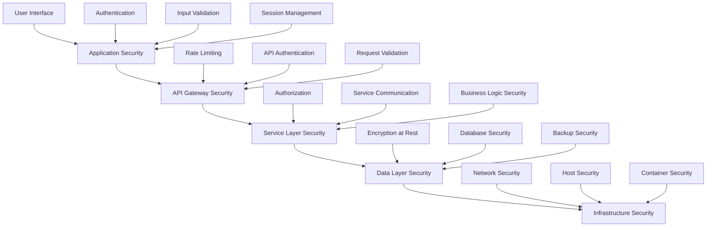

# Security & Compliance Framework
## Torvan Medical CleanStation Production Workflow Digitalization

**Version:** 1.0  
**Date:** December 2024  
**Document Type:** Security & Compliance Specification  
**Scope:** Complete System Security Architecture

---

## Executive Summary

This document establishes the comprehensive security and compliance framework for the CleanStation digitalization system, ensuring protection of sensitive data, regulatory compliance with medical device manufacturing standards, and robust security controls throughout the production workflow.

### Security Objectives
- **Data Protection** - Safeguard sensitive manufacturing and quality data
- **Access Control** - Ensure role-based access to system functions
- **Audit Compliance** - Maintain complete audit trail for regulatory requirements
- **Threat Prevention** - Protect against cyber security threats
- **Regulatory Adherence** - Meet ISO 13485:2016 and related standards
- **Business Continuity** - Ensure system availability and data integrity

### Compliance Requirements
- **ISO 13485:2016** - Medical device quality management systems
- **FDA 21 CFR Part 820** - Quality System Regulation
- **GDPR** - General Data Protection Regulation (EU data handling)
- **SOC 2 Type II** - Security, availability, and confidentiality controls
- **Industry Standards** - NIST Cybersecurity Framework alignment

---

## Security Architecture Overview

### Security Framework Design
```typescript
interface SecurityArchitecture {
  authentication: {
    primary: 'JWT with RSA256 signing';
    mfa: 'TOTP-based two-factor authentication';
    sessionManagement: 'Secure session handling with timeout';
    passwordPolicy: 'Strong password requirements';
  };
  
  authorization: {
    model: 'Role-Based Access Control (RBAC)';
    permissions: 'Granular permission system';
    dataAccess: 'Attribute-based access control';
    apiSecurity: 'Endpoint-level authorization';
  };
  
  dataProtection: {
    encryption: 'AES-256 at rest, TLS 1.3 in transit';
    keyManagement: 'AWS KMS for encryption keys';
    dataClassification: 'Sensitive data identification';
    retention: 'Policy-driven data lifecycle';
  };
  
  monitoring: {
    logging: 'Comprehensive audit logging';
    alerting: 'Real-time security event detection';
    siem: 'Security Information and Event Management';
    compliance: 'Automated compliance reporting';
  };
}
```

### Security Layers


---

## Authentication & Authorization

### Authentication System
```typescript
interface AuthenticationConfig {
  jwtConfiguration: {
    algorithm: 'RS256';
    issuer: 'cleanstation-auth-service';
    audience: 'cleanstation-api';
    accessTokenExpiry: '1h';
    refreshTokenExpiry: '30d';
    keyRotation: 'Every 90 days';
  };
  
  passwordPolicy: {
    minLength: 12;
    requireUppercase: true;
    requireLowercase: true;
    requireNumbers: true;
    requireSpecialChars: true;
    prohibitCommon: true;
    history: 12; // Previous passwords remembered
    maxAge: 90; // Days before forced change
  };
  
  mfaConfiguration: {
    enabled: true;
    methods: ['TOTP', 'SMS', 'Email'];
    backupCodes: 10;
    enforcementRoles: ['Admin', 'QC Person', 'Production Coordinator'];
  };
  
  sessionManagement: {
    timeout: '2h'; // Idle timeout
    absoluteTimeout: '8h'; // Maximum session duration
    concurrentSessions: 3; // Max sessions per user
    deviceTracking: true;
  };
}
```

### Role-Based Access Control
```typescript
interface RBACSystem {
  roles: {
    'Admin': {
      permissions: [
        'user:*',
        'catalog:*',
        'system:*',
        'reports:*',
        'audit:read'
      ];
      dataAccess: 'All data with audit logging';
    };
    
    'Production Coordinator': {
      permissions: [
        'orders:create',
        'orders:read',
        'orders:update',
        'bom:read',
        'notifications:read'
      ];
      dataAccess: 'All production data';
    };
    
    'Procurement Specialist': {
      permissions: [
        'bom:read',
        'bom:approve',
        'bom:reject',
        'orders:read',
        'parts:read'
      ];
      dataAccess: 'BOM and procurement data';
    };
    
    'QC Person': {
      permissions: [
        'qc:read',
        'qc:create',
        'qc:submit',
        'orders:read',
        'forms:*'
      ];
      dataAccess: 'QC forms and order quality data';
    };
    
    'Assembler': {
      permissions: [
        'assembly:read',
        'assembly:update',
        'tasks:complete',
        'orders:read'
      ];
      dataAccess: 'Assembly tasks and related data';
    };
    
    'Service Department': {
      permissions: [
        'service:*',
        'parts:read',
        'customers:read',
        'requests:*'
      ];
      dataAccess: 'Service requests and parts catalog';
    };
  };
}
```

### Permission Matrix
```typescript
interface PermissionMatrix {
  orders: {
    create: ['Admin', 'Production Coordinator'];
    read: ['Admin', 'Production Coordinator', 'Procurement Specialist', 'QC Person', 'Assembler'];
    update: ['Admin', 'Production Coordinator'];
    delete: ['Admin'];
    status_change: ['Admin', 'Production Coordinator', 'QC Person'];
  };
  
  qc_forms: {
    create: ['Admin', 'QC Person'];
    read: ['Admin', 'QC Person', 'Production Coordinator'];
    submit: ['Admin', 'QC Person'];
    approve: ['Admin', 'QC Person'];
  };
  
  bom: {
    generate: ['Admin', 'Production Coordinator'];
    read: ['Admin', 'Production Coordinator', 'Procurement Specialist'];
    approve: ['Admin', 'Procurement Specialist'];
    reject: ['Admin', 'Procurement Specialist'];
  };
  
  admin_functions: {
    user_management: ['Admin'];
    system_config: ['Admin'];
    audit_logs: ['Admin'];
    backup_restore: ['Admin'];
  };
}
```

---

## Data Protection & Encryption

### Data Classification
```typescript
interface DataClassification {
  public: {
    description: 'Non-sensitive information';
    examples: ['Product documentation', 'General company info'];
    protection: 'Standard access controls';
  };
  
  internal: {
    description: 'Internal business information';
    examples: ['Process workflows', 'Internal documentation'];
    protection: 'Employee access only';
  };
  
  confidential: {
    description: 'Sensitive business information';
    examples: ['Customer data', 'Order details', 'Quality records'];
    protection: 'Role-based access with encryption';
  };
  
  restricted: {
    description: 'Highly sensitive regulated data';
    examples: ['Quality compliance data', 'Audit trails', 'Personal data'];
    protection: 'Strict access controls with audit logging';
  };
}
```

### Encryption Standards
```typescript
interface EncryptionStandards {
  dataAtRest: {
    algorithm: 'AES-256-GCM';
    keyManagement: 'AWS KMS';
    keyRotation: 'Annual with emergency rotation capability';
    implementation: 'Database-level and file-level encryption';
  };
  
  dataInTransit: {
    protocol: 'TLS 1.3';
    cipherSuites: [
      'TLS_AES_256_GCM_SHA384',
      'TLS_CHACHA20_POLY1305_SHA256',
      'TLS_AES_128_GCM_SHA256'
    ];
    certificateManagement: 'Let\'s Encrypt with automated renewal';
    hsts: 'Enforced with max-age 31536000';
  };
  
  dataInUse: {
    applicationLevel: 'Field-level encryption for PII';
    memoryProtection: 'Secure memory handling practices';
    processIsolation: 'Container-based isolation';
  };
  
  keyManagement: {
    generation: 'Hardware Security Module (HSM)';
    distribution: 'Secure key exchange protocols';
    storage: 'AWS KMS with access logging';
    rotation: 'Automated rotation with audit trail';
    backup: 'Encrypted key backups in separate regions';
  };
}
```

### Data Retention & Disposal
```typescript
interface DataLifecyclePolicy {
  retention: {
    qualityRecords: '7 years (ISO 13485 requirement)';
    auditLogs: '7 years (regulatory compliance)';
    personalData: '5 years or until consent withdrawal';
    orderData: '7 years (business records)';
    systemLogs: '13 months (security analysis)';
    backupData: '7 years with quarterly verification';
  };
  
  disposal: {
    method: 'NIST 800-88 compliant data destruction';
    verification: 'Certificate of destruction required';
    documentation: 'Disposal logs with witness signatures';
    mediaDestruction: 'Physical destruction for storage media';
  };
  
  archival: {
    coldStorage: 'Move to cold storage after 2 years';
    compression: 'Lossless compression for archived data';
    indexing: 'Searchable metadata for compliance retrieval';
    verification: 'Annual integrity checks';
  };
}
```

---

## Audit Logging & Monitoring

### Comprehensive Audit Logging
```typescript
interface AuditLoggingSystem {
  auditEvents: {
    authentication: [
      'User login/logout',
      'Failed authentication attempts',
      'Password changes',
      'MFA events',
      'Session management'
    ];
    
    dataAccess: [
      'Record creation/modification/deletion',
      'Data export/import',
      'Sensitive data access',
      'Report generation',
      'Search queries'
    ];
    
    systemActions: [
      'Configuration changes',
      'User management actions',
      'System maintenance',
      'Backup/restore operations',
      'Security events'
    ];
    
    businessProcess: [
      'Order lifecycle events',
      'QC form submissions',
      'BOM approvals',
      'Status changes',
      'Workflow transitions'
    ];
  };
  
  auditLogStructure: {
    eventId: 'Unique identifier for each event';
    timestamp: 'ISO 8601 format with timezone';
    userId: 'User performing the action';
    sessionId: 'Session identifier';
    eventType: 'Category of the event';
    action: 'Specific action performed';
    resource: 'Resource affected';
    oldValues: 'Previous values (for updates)';
    newValues: 'New values (for updates)';
    outcome: 'Success/failure status';
    ipAddress: 'Source IP address';
    userAgent: 'Client information';
    additionalContext: 'Event-specific metadata';
  };
}
```

### Security Monitoring
```typescript
interface SecurityMonitoring {
  realTimeAlerts: {
    failedLogins: 'Multiple failed attempts from same IP/user';
    privilegeEscalation: 'Unauthorized access attempts';
    dataExfiltration: 'Unusual data export patterns';
    systemIntrusion: 'Suspicious system access';
    configurationChanges: 'Unauthorized system modifications';
  };
  
  behavioralAnalytics: {
    userPatterns: 'Baseline user behavior analysis';
    anomalyDetection: 'Statistical anomaly identification';
    riskScoring: 'Risk-based user activity scoring';
    adaptiveAuth: 'Dynamic authentication requirements';
  };
  
  threatIntelligence: {
    ipReputation: 'Malicious IP address blocking';
    signatureDetection: 'Known attack pattern detection';
    vulnerabilityScanning: 'Automated security assessments';
    patchManagement: 'Security update tracking';
  };
  
  incidentResponse: {
    alertTriage: 'Automated alert prioritization';
    escalationProcedures: 'Incident escalation workflows';
    responsePlaybooks: 'Predefined response procedures';
    forensicCapability: 'Evidence collection and analysis';
  };
}
```

---

## Regulatory Compliance

### ISO 13485:2016 Compliance
```typescript
interface ISO13485Compliance {
  documentControl: {
    requirement: 'Controlled documents and records';
    implementation: 'Version-controlled system documentation';
    evidence: 'Document approval workflows and change logs';
  };
  
  managementResponsibility: {
    requirement: 'Management commitment to quality';
    implementation: 'Security governance and oversight';
    evidence: 'Security policy approvals and reviews';
  };
  
  resourceManagement: {
    requirement: 'Competent personnel and training';
    implementation: 'Security training and awareness programs';
    evidence: 'Training records and competency assessments';
  };
  
  productRealization: {
    requirement: 'Controlled production processes';
    implementation: 'Secure digital workflows with validation';
    evidence: 'Process validation and security controls';
  };
  
  measurementAndImprovement: {
    requirement: 'Monitoring and continuous improvement';
    implementation: 'Security metrics and incident learning';
    evidence: 'Security dashboards and improvement actions';
  };
}
```

### Data Privacy Compliance
```typescript
interface DataPrivacyCompliance {
  gdprCompliance: {
    lawfulBasis: 'Legitimate business interest for manufacturing';
    dataMinimization: 'Collect only necessary data';
    purposeLimitation: 'Use data only for stated purposes';
    accuracyPrinciple: 'Maintain accurate and up-to-date data';
    storageMinimization: 'Retain data only as long as necessary';
    integrityConfidentiality: 'Secure data processing';
    accountability: 'Demonstrate compliance measures';
  };
  
  subjectRights: {
    accessRight: 'Provide data access upon request';
    rectificationRight: 'Correct inaccurate data';
    erasureRight: 'Delete data when no longer needed';
    portabilityRight: 'Provide data in machine-readable format';
    objectionRight: 'Allow objection to processing';
    restrictionRight: 'Restrict processing upon request';
  };
  
  privacyByDesign: {
    dataProtectionImpactAssessment: 'DPIA for high-risk processing';
    privacyNotices: 'Clear privacy information';
    consentManagement: 'Explicit consent where required';
    dataProtectionOfficer: 'Designated DPO contact';
    breachNotification: '72-hour breach notification procedure';
  };
}
```

---

## Security Controls Implementation

### Network Security
```typescript
interface NetworkSecurity {
  perimeter: {
    firewall: 'Next-generation firewall with IPS';
    dmz: 'Demilitarized zone for external access';
    vpn: 'Site-to-site and remote access VPN';
    ddosProtection: 'Distributed denial of service protection';
  };
  
  segmentation: {
    vlan: 'Virtual LAN segmentation by function';
    microSegmentation: 'Application-level network isolation';
    zeroTrust: 'Never trust, always verify model';
    accessControl: 'Network access control (NAC)';
  };
  
  monitoring: {
    ids: 'Intrusion detection system';
    ips: 'Intrusion prevention system';
    netflow: 'Network traffic analysis';
    siem: 'Security information and event management';
  };
}
```

### Application Security
```typescript
interface ApplicationSecurity {
  secureCodePractices: {
    staticAnalysis: 'SAST tools in CI/CD pipeline';
    dynamicAnalysis: 'DAST testing in staging';
    dependencyScanning: 'Third-party vulnerability scanning';
    codeReview: 'Mandatory security code reviews';
  };
  
  runtimeProtection: {
    waf: 'Web application firewall';
    rasp: 'Runtime application self-protection';
    apiSecurity: 'API gateway with rate limiting';
    inputValidation: 'Comprehensive input sanitization';
  };
  
  securityTesting: {
    penetrationTesting: 'Annual third-party pen testing';
    vulnerabilityAssessment: 'Quarterly security scans';
    redTeaming: 'Annual red team exercises';
    bugBounty: 'Responsible disclosure program';
  };
}
```

### Infrastructure Security
```typescript
interface InfrastructureSecurity {
  cloudSecurity: {
    iam: 'Identity and access management';
    encryption: 'Encryption at rest and in transit';
    logging: 'CloudTrail and VPC flow logs';
    monitoring: 'CloudWatch and security alerts';
  };
  
  containerSecurity: {
    imageScanning: 'Container image vulnerability scanning';
    runtimeSecurity: 'Container runtime protection';
    secretsManagement: 'Secure secrets injection';
    networkPolicies: 'Kubernetes network policies';
  };
  
  endpointSecurity: {
    antimalware: 'Next-generation antimalware';
    edr: 'Endpoint detection and response';
    deviceControl: 'USB and device access control';
    patchManagement: 'Automated security patching';
  };
}
```

---

## Incident Response & Business Continuity

### Incident Response Plan
```typescript
interface IncidentResponsePlan {
  incidentClassification: {
    p1: 'Critical security incident with immediate business impact';
    p2: 'High security incident with significant impact';
    p3: 'Medium security incident with moderate impact';
    p4: 'Low security incident with minimal impact';
  };
  
  responseTeam: {
    incidentCommander: 'Overall incident coordination';
    securityAnalyst: 'Technical security analysis';
    systemAdministrator: 'System remediation actions';
    communicationsLead: 'Stakeholder communications';
    legalCounsel: 'Legal and regulatory guidance';
  };
  
  responseProcess: {
    detection: 'Incident identification and triage';
    containment: 'Immediate threat containment';
    eradication: 'Root cause elimination';
    recovery: 'System restoration and validation';
    lessonsLearned: 'Post-incident analysis and improvement';
  };
  
  communicationPlan: {
    internal: 'Employee and management notifications';
    external: 'Customer and partner communications';
    regulatory: 'Regulatory body notifications';
    media: 'Public communications if necessary';
  };
}
```

### Business Continuity Planning
```typescript
interface BusinessContinuityPlan {
  rto: '4 hours'; // Recovery Time Objective
  rpo: '1 hour';  // Recovery Point Objective
  
  backupStrategy: {
    frequency: 'Continuous replication with point-in-time recovery';
    retention: '7 years for compliance data';
    testing: 'Monthly backup restoration testing';
    offsite: 'Multi-region backup storage';
  };
  
  disasterRecovery: {
    hotSite: 'Active-passive multi-region deployment';
    failover: 'Automated failover with manual validation';
    communication: 'Emergency communication procedures';
    testing: 'Quarterly DR testing exercises';
  };
  
  emergencyProcedures: {
    systemShutdown: 'Emergency system shutdown procedures';
    dataProtection: 'Emergency data protection measures';
    alternativeProcedures: 'Manual process documentation';
    vendorContacts: 'Emergency vendor contact information';
  };
}
```

---

## Security Training & Awareness

### Security Training Program
```typescript
interface SecurityTrainingProgram {
  generalTraining: {
    frequency: 'Annual with quarterly updates';
    topics: [
      'Password security and MFA',
      'Phishing and social engineering',
      'Data classification and handling',
      'Incident reporting procedures',
      'Acceptable use policies'
    ];
    delivery: 'Online modules with assessments';
    certification: 'Training completion certificates';
  };
  
  roleSpecificTraining: {
    administrators: 'Advanced security administration';
    developers: 'Secure coding practices';
    qcPersonnel: 'Data integrity and compliance';
    management: 'Security governance and risk';
  };
  
  awarenessProgram: {
    phishingSimulation: 'Monthly phishing simulation tests';
    securityUpdates: 'Weekly security news and updates';
    policyReminders: 'Quarterly policy acknowledgments';
    incidentLearning: 'Lessons learned from security incidents';
  };
}
```

---

## Compliance Monitoring & Reporting

### Compliance Dashboard
```typescript
interface ComplianceDashboard {
  realTimeMetrics: {
    auditTrailCompleteness: 'Percentage of events logged';
    accessControlCompliance: 'RBAC policy adherence';
    encryptionCoverage: 'Data encryption status';
    backupSuccess: 'Backup completion rates';
    securityUpdates: 'Patch compliance status';
  };
  
  complianceReports: {
    iso13485: 'Monthly compliance status report';
    dataPrivacy: 'Quarterly privacy compliance report';
    securityPosture: 'Monthly security scorecard';
    incidentSummary: 'Quarterly incident analysis';
    auditPreparation: 'Annual audit readiness report';
  };
  
  alerting: {
    complianceViolations: 'Real-time compliance alerts';
    policyDeviations: 'Policy violation notifications';
    certificationExpiry: 'Certificate renewal reminders';
    auditSchedule: 'Audit preparation notifications';
  };
}
```

This security and compliance framework ensures the CleanStation digitalization system maintains the highest standards of data protection, regulatory compliance, and security controls necessary for medical device manufacturing environments. 